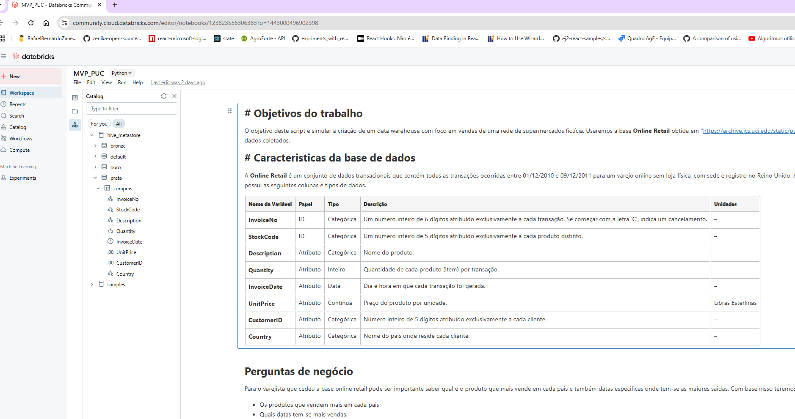
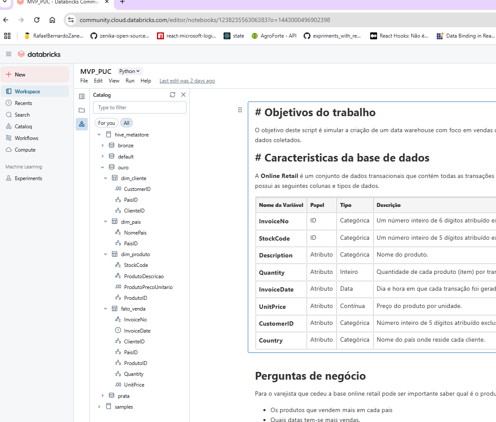

Link para apuração do codigo rodando no databricks
https://databricks-prod-cloudfront.cloud.databricks.com/public/4027ec902e239c93eaaa8714f173bcfc/1443000496902398/123823556306383/77679524966915/latest.html

Abaixo são evidências da criação das camadas bronze,prata e ouro e suas devidas entidades

