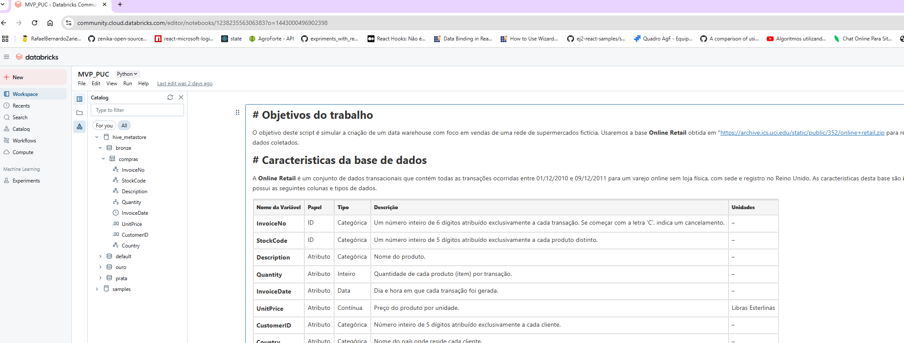

# 🧾 Pipeline de Dados - Camadas Bronze, Prata e Ouro

## 🔗 Apuração do Código no Databricks

Clique no link abaixo para visualizar a execução completa do pipeline no ambiente Databricks:

👉 [Acesse a apuração do código no Databricks](https://databricks-prod-cloudfront.cloud.databricks.com/public/4027ec902e239c93eaaa8714f173bcfc/1443000496902398/123823556306383/77679524966915/latest.html)

---

## 📸 Evidências da Criação das Camadas

Abaixo estão as evidências visuais da criação das camadas **Bronze**, **Prata** e **Ouro**, com suas respectivas entidades:

### 🟫 Camada Bronze

---

### 🥈 Camada Prata

---

### 🥇 Camada Ouro

